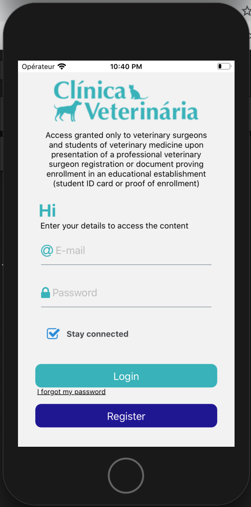
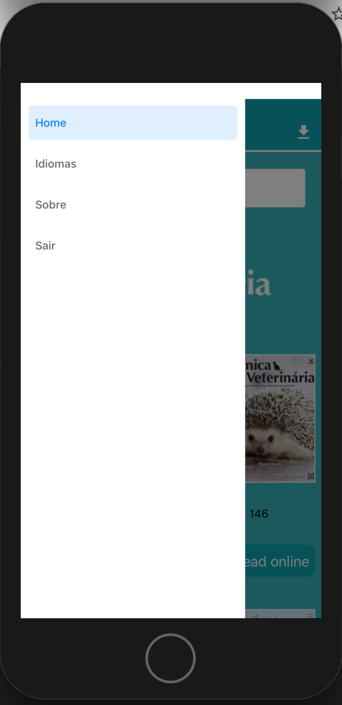
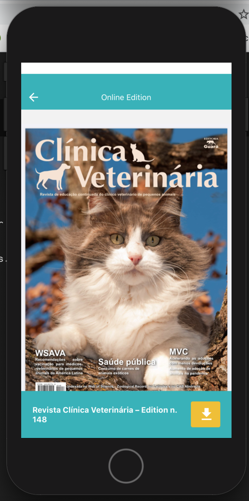

# React-Native-Revista-Clinica-Veterinaria

App para visualização de pdfs diretamente da nuvem e download no aparelho.

<h4 align="center"> 
✓ Finalizado
</h4>

### Features

- [x] Cadastro de usuário
- [x] Login de usuário com JWT
- [x] Recuperação de senha
- [x] Visualização de pdfs
- [x] Download de pdfs para ler offline
- [x] Rotas com autenticação conforme JWT
- [x] Busca de artigos
- [x] Multilinguagem: identifica automaticamente o idioma do aparelho e usa como idioma padrão do aplicativo
- [x] React navigation: Drawer Menu e Stack, simultaneamente
- [x] Activity indicator para melhorar a experiência

### Pré-requisitos

Antes de começar, você vai precisar ter instalado em sua máquina as seguintes ferramentas:
React native(https://reactnative.dev). 
Além disto é bom ter um editor para trabalhar com o código como [VSCode](https://code.visualstudio.com/).

### 🎲 Back End (servidor)

```Api
O backend foi feito em C#, e as chamadas às apis foram tiradas do projeto. 
```

### Algumas imagens do projeto

<h1 align="center">
  
</h1>
<h1 align="center">
  
</h1>
<h1 align="center">
  
</h1>
<h1 align="center">
  
</h1>
